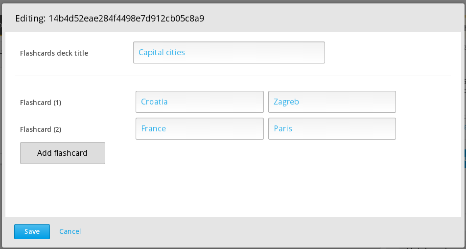
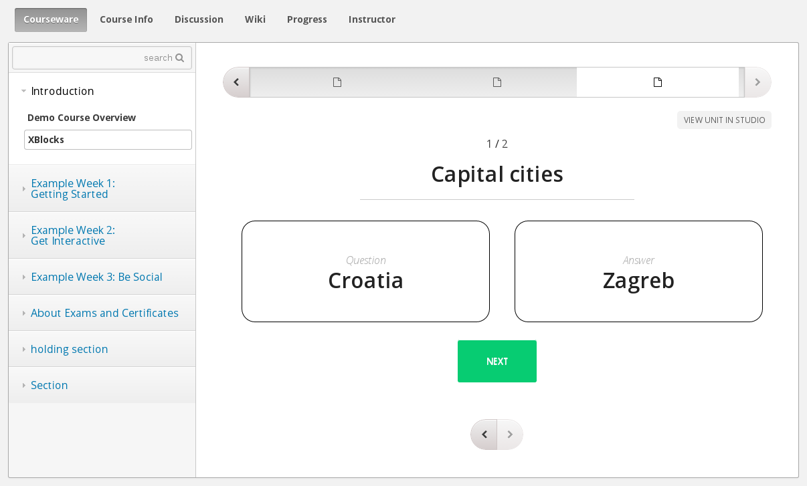

# FlashcardsXBlock
An Open edX platform XBlock to create and display flashcards.

The flashcards are added like this:

```html
<flashcards title="Capital cities">
<flashcard front="Croatia" back="Zagreb" />
<flashcard front="France" back="Paris" />
</flashcards>
```

The XBlock in Studio looks like this:


Output looks like this:



---
contact: vkaracic@extensionengine.com
